## Landing Page
This landing page is what users see first.

| Mobile View | Desktop View |
|-------------|--------------|
| 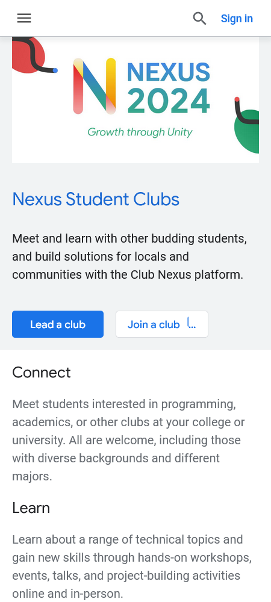 | 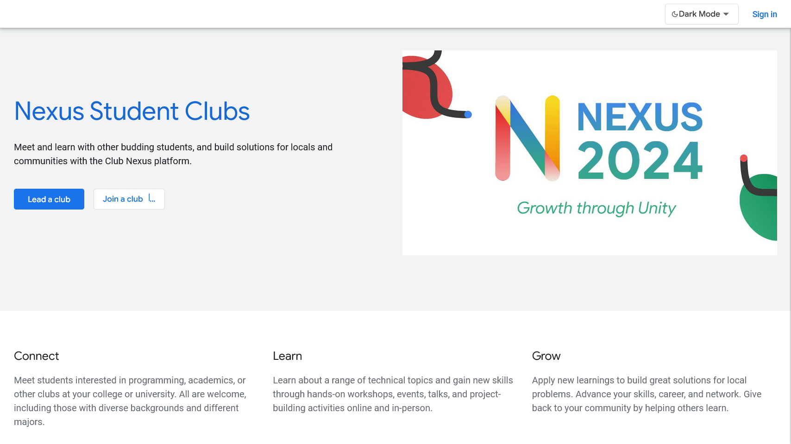 |
| 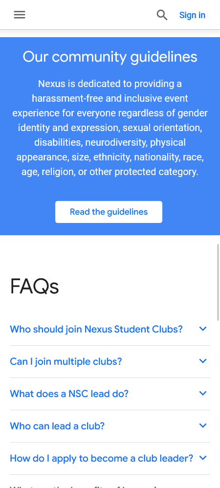 | 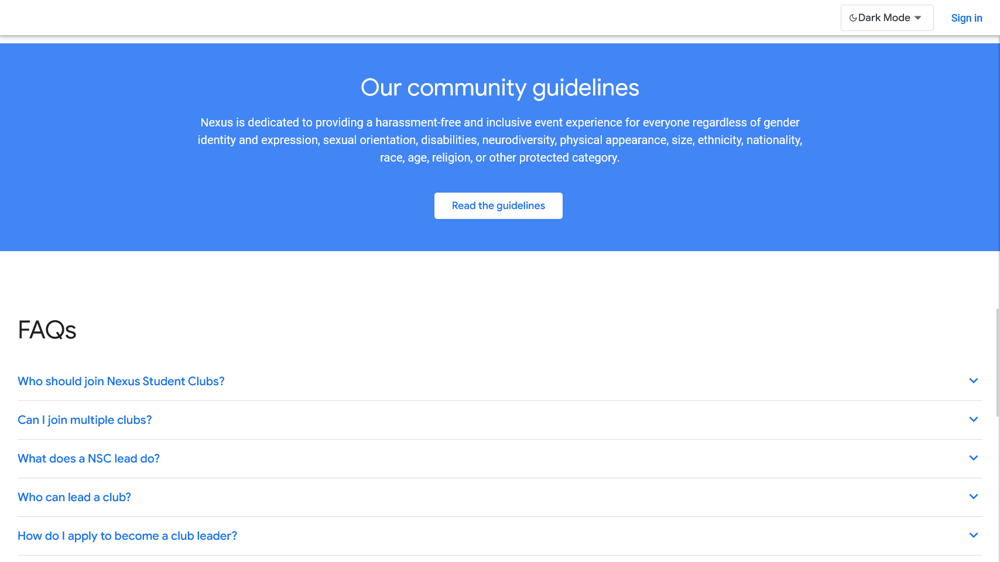 |

## Signin Page
This is the signin page.

|  | |
|-------------|--------------|
| 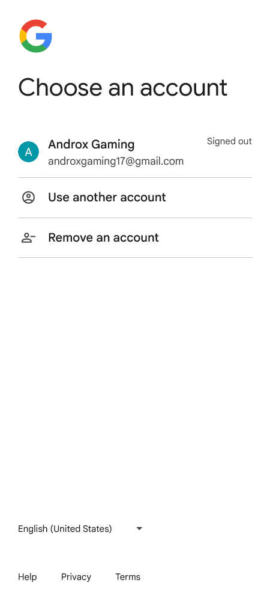 | 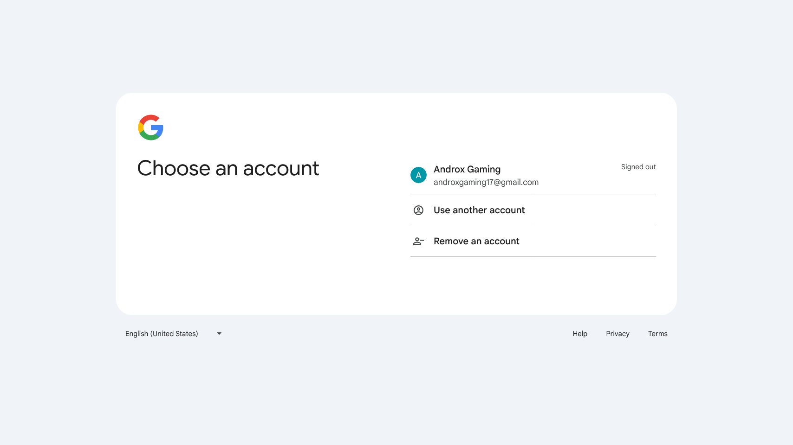 |

## Home Page
The home page displayed when a user is Signed in.

|  | |
|-------------|--------------|
| 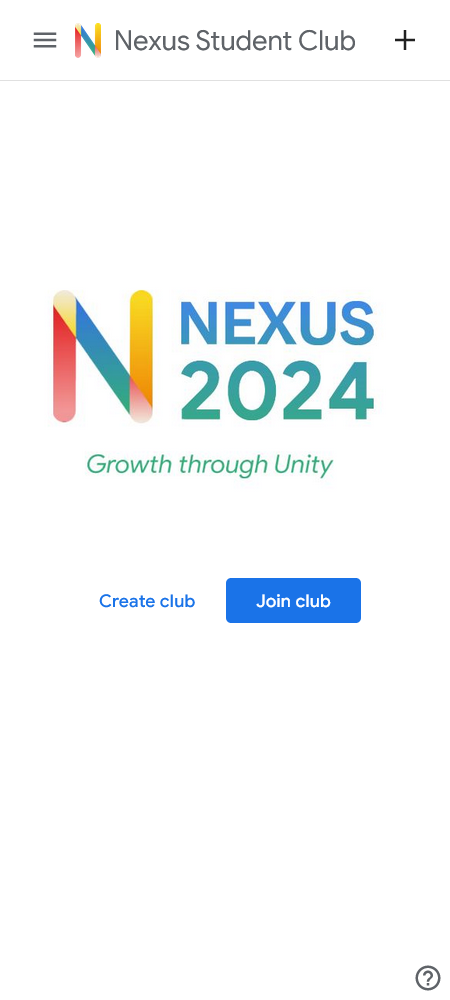 | 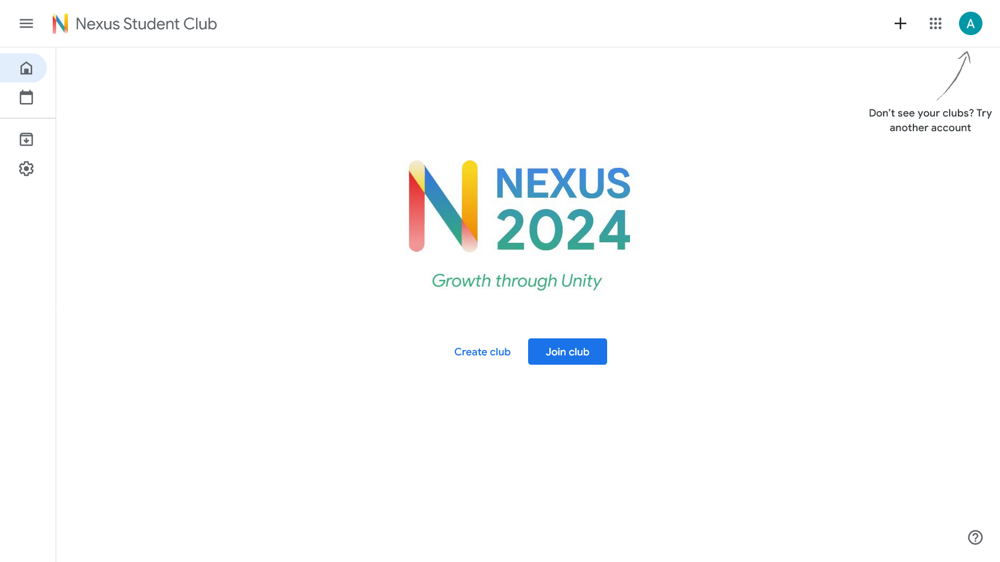 |

## Join Page
This section is where users join a club using a 5-7 alphanumeric code.

|  | |
|-------------|--------------|
| 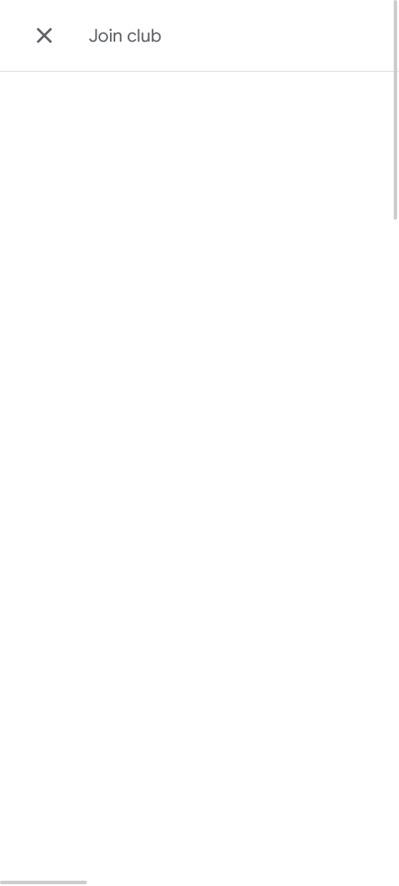 | 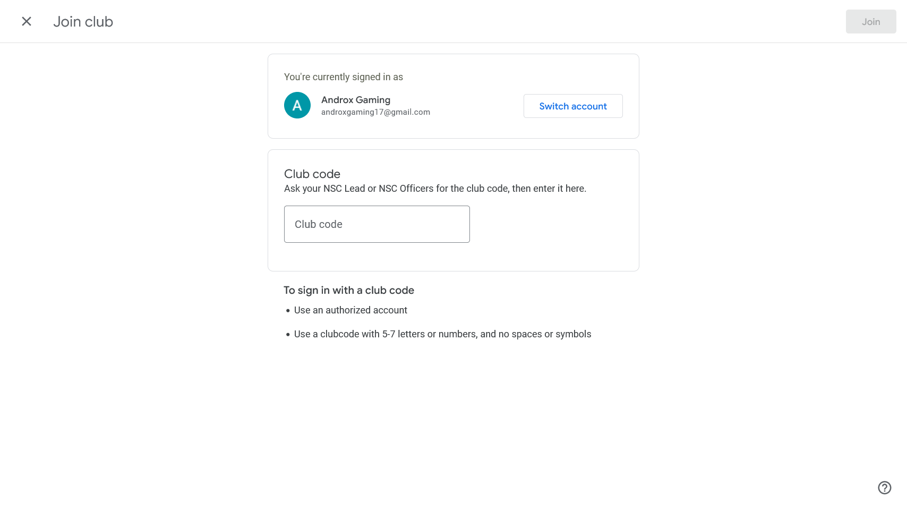 |

## Permission Page
This page provides guidelines and permissions for users who want to lead a club.

|  | |
|-------------|--------------|
| 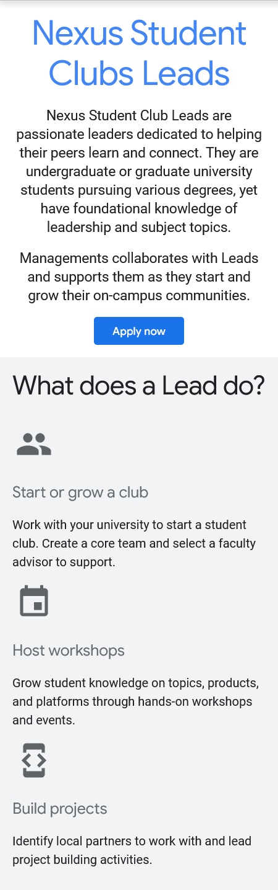 | 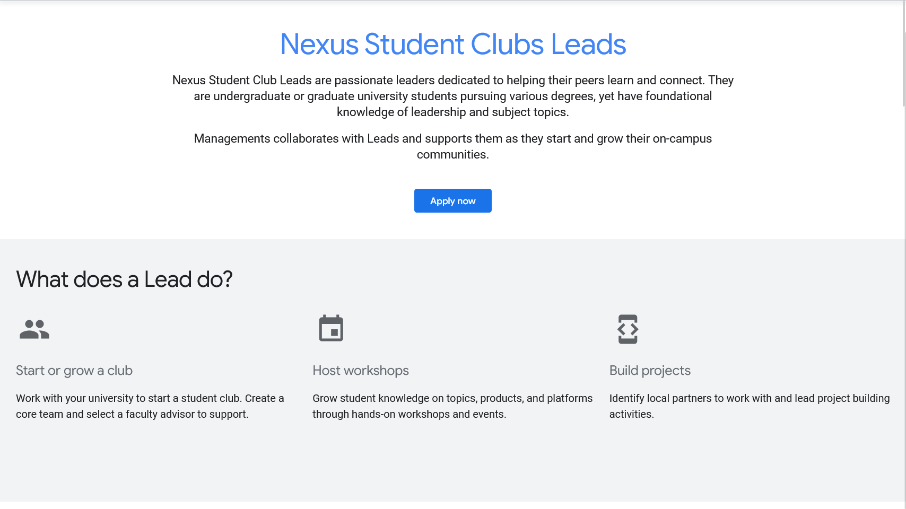 |

## Create Page
This section is where a club leader creates a club with their team.

|  | |
|-------------|--------------|
| 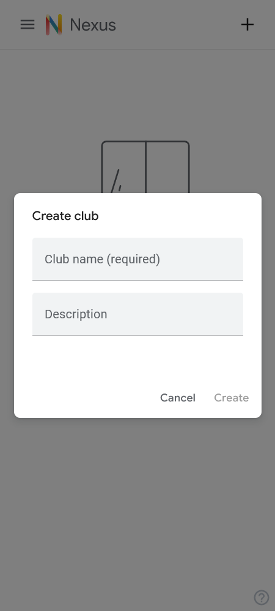 | 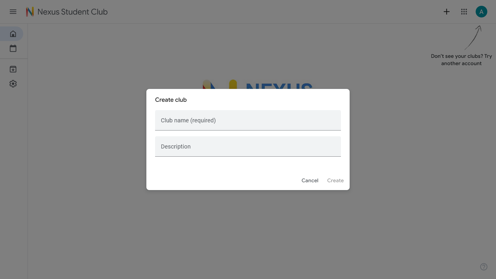 |

## Discussion Page
This page displays discussion contents, such as resources, questions, and tips.

|  | |
|-------------|--------------|
| 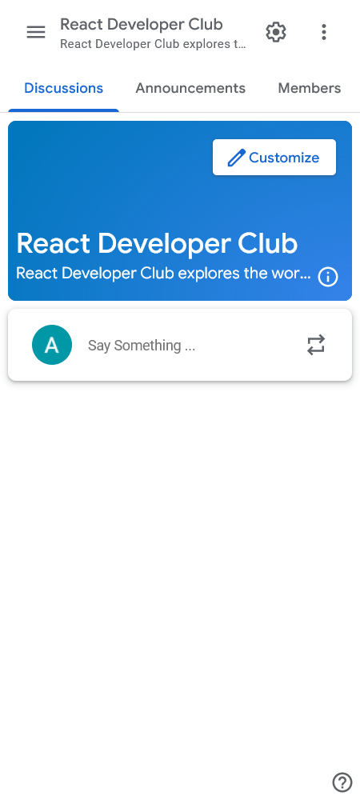 | 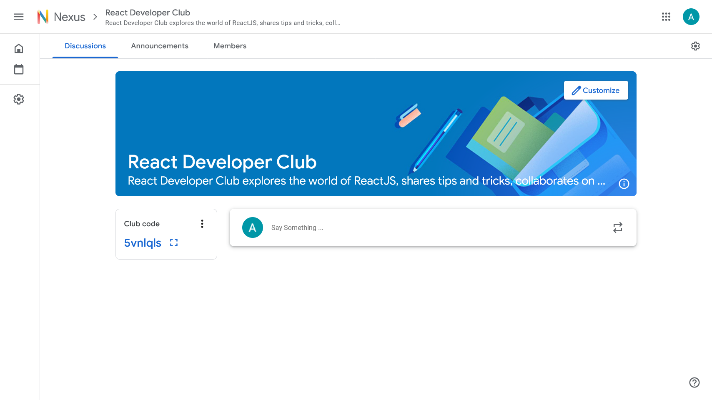 |

## Announcement Page
This page is responsible for important events, announcements, and important resources.

|  | |
|-------------|--------------|
| 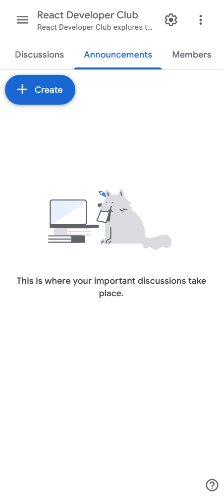 | 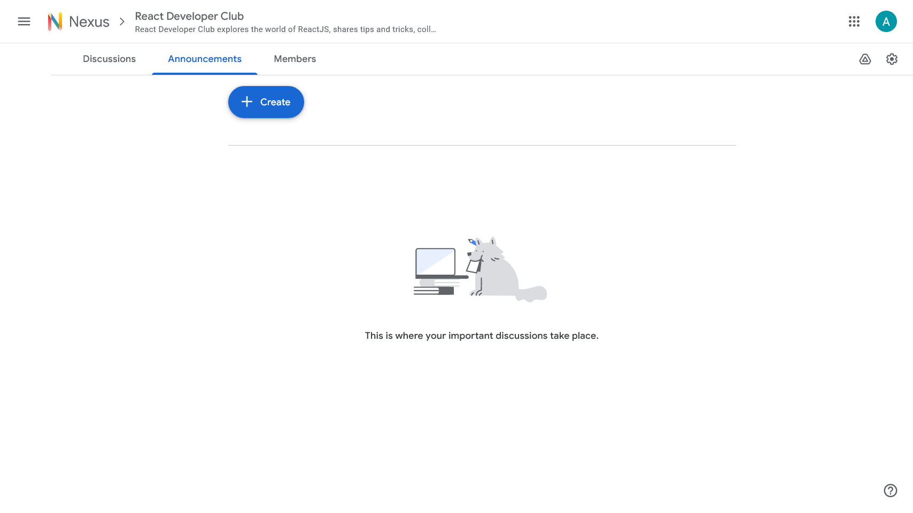 |

## People Page
This page displays the members, and officers of the club.

|  | |
|-------------|--------------|
| 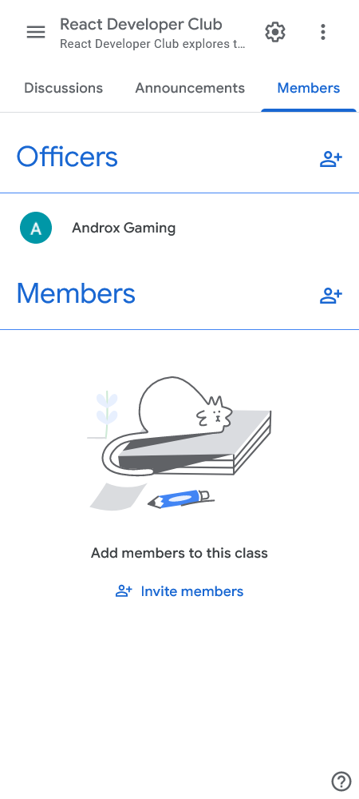 | 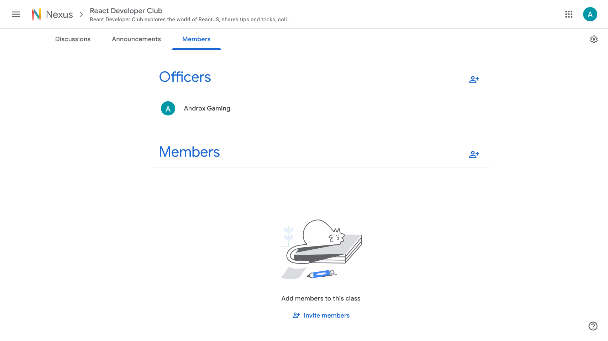 |

##END
